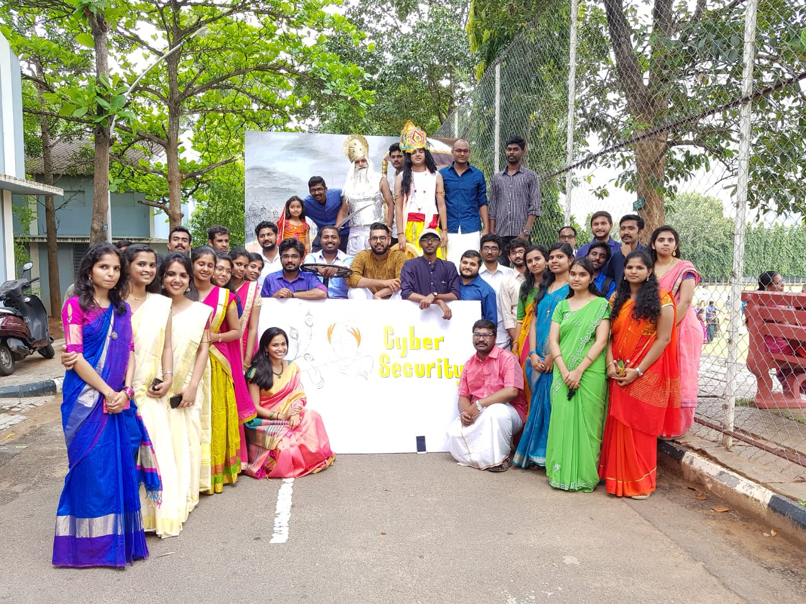
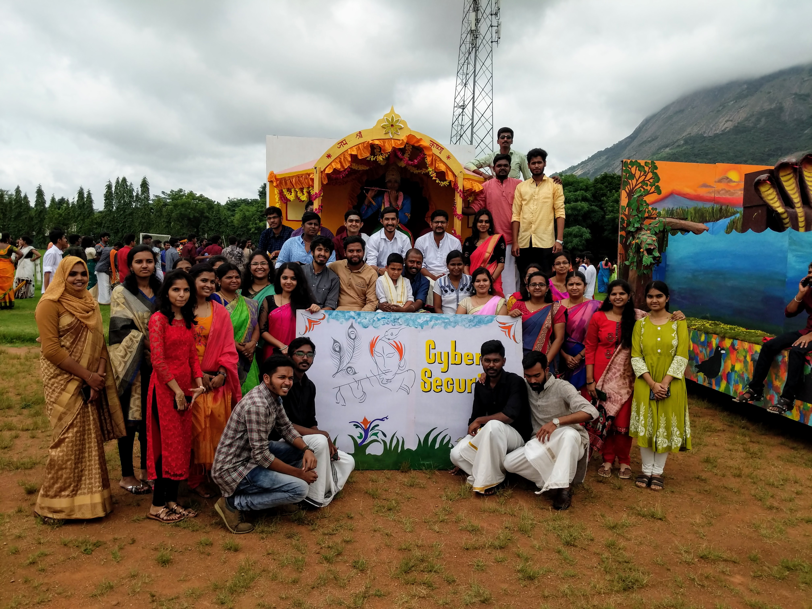

# Gokulashtami

## 2015 : Krishna As the Gita Archarya 

## 2016 : Vasudeva Taking Krishna to Vrindavan

  

[Click Here](2016) to view in Detail.

## 2017 - 12th August : Govardhana Giridhara

  
  

[Click Here](2017) to view in Detail.

## 2018 - 01st October : Krishna As the Gita Acharya

  

[Click Here](2018) to view in Detail.

## 2019 - 23rd August : 

  

[Click Here](2019) to view in Detail.

## 2022

[Click Here](2022) to view in Detail.
